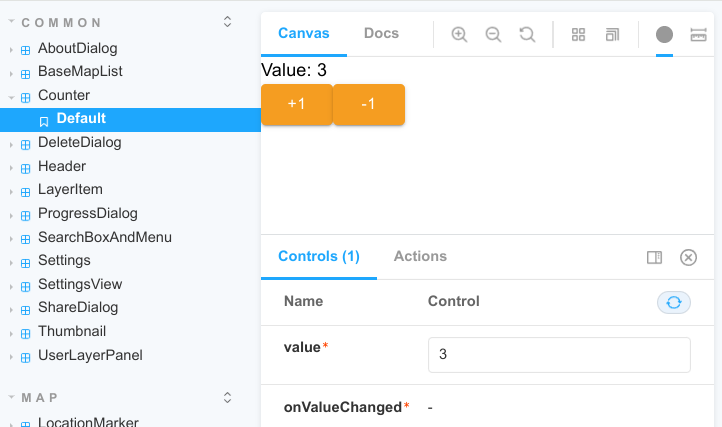

# Catalunya Offline v3. Manual per a desenvolupadors

En essència es tracta d'un desenvolupament frontend Javascript que s'encapsula i distrubueix com Apps natives gràcies a Capacitor. 

El codi ressideix a: https://github.com/OpenICGC/catalunya-offline-v2

Al README d'aquest repositori hi trobem com preparar l'entorn de treball i executar les tasques habituals. No les repetirem aquí.


## Dependències de Javascript

Dependències per al desenvolupament i gestió:

* TypeScript
* Eslint
* Webpack 5
* Storybook
* Tests: Karma + chai + mocha
* Sentry

Frameworks i llibreries essencials:

* React 17
* Material UI 5 (mui)
* Maplibre 2


Llibreries auxiliars:

* Geocomponents: Components presentacionals per a visors de mapes. Documentació: https://labs.geomatico.es/geocomponents/
* Loaders.gl: Importació d'arxius CSV, GeoJSON, GPX, KML, SHP+ZIP.
* Turf: Operacions geomètriques.
* Pako: Descompressió en JS. Usat per a la lectura de tessel.les des de MBTiles.
* Moment: Gestió de dades i intervals temporals.
* Vega: Gràfiques.


## Plugins de Capacitor

A més, es fa servir Capacitor v4 per:
1. Encapsular la web dins un projecte Android o iOS, de manera que es comporti com una App i es pugui compilar i distribuïr per a les diferents plataformes.
2. Accedir al hardware dels dispositius mitjançant plug-ins.

Moltes vegades hem trobat que els plugins oficials de capacitor són insuficients. En aquest cas hem buscat alternatives, primer, als plugins "community" de capacitor, després, a "capawesome", i per últim al vell conegut cordova, gracies al projecte "awesome-cordova-plugins".

En els moments d'escriure aquestes línies es fan servir els següents:

Plugins oficials:

* App: Permet saber si l'aplicació està en foreground o en background, permet optimitzar funcionament en background.
* Camera: Per tirar fotos o sel.leccionar-les de la galeria.
* Filesystem: Permet manipular el sistema de fitxers, utilitzat per gestionar les dades offline.
* Preferences: Es fa servir per a tota la persistència (settings, estat de l'aplicació, àmbits, capes d'usuari).
* Share: Per compartir un recurs amb qualsevol de les aplicacions instal.lades que el suportin (OneDrive, Google Drive, Telegram, ...).

Plugins community:

* Background-geolocation: Permet usar el GPS, també mentre l'aplicació està en segon pla.
* Network-react: Wrapper per al plugin oficial Network. Permet saber si estem offline, amb wifi o amb dades mòbils.
* Photoviewer
* SQLite

Plugins capawesome:

* Capacitor-file-picker: Permet importar fitxers des del dispositiu (capes d'usuari i àmbits).

Plugins awesome-cordova-plugins:

* Device-orientation: Per a la brúixola.
* File-transfer: Al gestor de descàrregues, permet desar fitxers binaris grans amb noció de progrés de descàrrega.
* Zip: Usat per descomprimir.

Altres:

* Capacitor-zip: És l'únic que ens ha permès comprimir en les dues plataformes.


## Organització del repositori

Al directori arrel hi ha tots els fitxers de configuració de les diferents eines de javascript, com ara:

* 'README.md' el fitxer més interessant per començar a treballar, on hi ha instruccions sobre com muntar l'entorn i executar el codi en diferents modes (dev, prod, android, ios...).
* `.env` on es defineix l'entorn. Aquí es desa la key de sentry, i potencialment s'hi posarien dades que canvien amb l'entorn dev/pre/prod (accés a serveis, passwords, etc).
* `.eslintrc` per al linter. Està preparat per funcionar amb typescript, react i i18n (comprova que els bundles de traducció siguin complerts, prenent el català com a referència).
* `babel.config.js` per al transpilador. Aquí es fa servir un plugin per transformar les Props dels components de react, definides en typescript, a PropTypes, de manera que es comprovin els tipus de les props també en temps d'execució (ajuda en dev mode).
* `karma.config.js`: per al testing. Processa tots els fitxers "src/*.spec*" (carregats via `src/test.js`), els passa per webpack i treu un report utilitzant Chrome Headless. Si es vol depurar un test, pot ser interessant canviar els browsers a `['Chrome']` i  posar singleRun a `false`.
* `tsconfig.json` per a la configuració typescript.
* `webpack.config.js` per a l'empaquetador del bundle de producció.
* I el més important, `package.json` on es defineixen les dependències i hi ha definides les tasques de desenvolupament executables amb 'npm'.

    * "test": Executa el linter i la test suite. Aquest atasca també s'executa automàticament abans de fer un commit a git per evitar que codi defectuós arribi al repo.
    * "start": Arrenca el projecte web en mode desenvolupament.
    * "start:android": Arrenca la App d'android en mode desenvolupament. Es connecta per wifi a la web servida per la comanda "start", que també haurà d'estar corrent simultàniament. Això permet debugar sobre dispositiu real amb live reload (useu `chrome://inspect#devices` per accedir a la consola remota).
    * "start:ios": Igual que l'anterior en l'entorn iOS.
    * "build": Genera el bundle de producció a la carpeta `dist/`, (part web/js).
    * "build:android": Fa el build anterior, el copia dins d'un projecte android i obre Android Studio. Des d'allà es pot decidir generar APK, arrencar l'App en un dispositiu/emulador, o publicar.
    * "build:ios": Ídem per a entorn iOS (obre XCode).
    * "storybook": Arrenca storybook en local, per provar els components presentacionals. Visitable a `http://localhost:6006`.

A més, trobem altres directoris:

* `android/` projecte d'Android Studio. Generat i gestionat per Capacitor.
* `ios/` projecte XCode. Generat i gestionat per Capacitor.
* `icons/` icones de l'app. Generat i gestionat per Capacitor.

* `node_modules/` on s'hi instal.len les dependències de javascript. Generat i gestionat per `npm install`. No s'inclou al repo.
* `dist/` és on es genera el "build" optimitzat per a producció. Generat i gestionat per npm/webpack. No s'inclou al repo.

* `doc/` documentació del projecte (com aquesta), en versió Markdown.
* `resources/` carpeta amb recursos diversos que ens interessa conservar però que no són part de l'aplicació. Per exemple, els SVG originals a partir dels quals hem generat icones personalitzades, exemples de bundles offline, etc.
* `static/` carpeta amb recursos que sí s'inclouen amb l'aplicació però que no són codi ni s'inclouen al bundle via "import". Per exemple, les capes d'usuari d'exemple, imatges estàtiques, etc.


## Organització del codi (`src/`)

Al directori base de `src/` hi tenim fitxers de configuració propis de l'aplicació, i el punt d'entrada:

* `i18n.ts` Configuració sobre el multiidioma (veure documentació dels paquets `i18next` i `react-i18next`).
* `allowJavascriptModules.ts`: Una 'trampa' per poder importar mòduls no typescript a projectes typescript (altres formats d'arxiu, o javascript sense tipar). No fer servir per a codi propi, que sempre haurà d'anar ben tipat.
* `test.ts` especifica quins fitxers incloure al bundle de test (`*.spec.*`).
* `theme.ts` el tema de Material UI que s'aplicarà a tot el projecte.
* `config.ts` variables de configuració propis de Catalunya Offline.
* `template.html` i `index.tsx` són els punts d'entrada al projecte.


### Components (presentacionals)

En principi, a la carpeta `src/components/` hi ha tot de components gràfics de l'aplicació que no depenen de serveis externs (accés a APIs o persistència), sinó que purament depenen del que se's passa com a "props". Les "props" poden ser:

  a. Valors, que es fan servir per "pintar" el component.
  b. Funcions de callback "onSomething", que es criden quan s'interactua amb el component (típicament clicks a llocs).

Exemple de component presentacional `Counter.tsx`:

```typescript jsx
import React, {FC} from 'react';
import Typography from '@mui/material/Typography';
import Button from '@mui/material/Button';

export interface CounterProps {
  value: number,
  onValueChanged: (newValue: number) => void
}

const Counter: FC<CounterProps> = ({value, onValueChanged}) => {
  const handleIncrease = () => onValueChanged(value + 1);

  const handleDecrease = () => onValueChanged(value - 1);

  return <>
    <Typography variant='body1'>Value: {value}</Typography>
    <Button variant='contained' onClick={handleIncrease}>+1</Button>
    <Button variant='contained' onClick={handleDecrease}>-1</Button>
  </>;
};
```

Per tal de poder documentar i testejar aquests components, s'hi creen stories a Storybook. Per exemple `counter.stories.jsx`:

```typescript jsx
import React from 'react';
import {Meta, Story} from '@storybook/react';

import Counter, {CounterProps} from './Counter';

export default {
  title: 'Common/Counter',
  component: Counter
} as Meta;

const Template: Story<CounterProps> = args => <Counter {...args}/>;

export const Default = Template.bind({});
Default.args = {
  value: 3
};
```

Que mostraria aquesta interfície:




### Hooks (codi react no presentacional)

Els 'hooks' serveixen per enriquir els components amb tot tipus de serveis. REACT en proporciona uns quants de base, per exemple per afegir estat (useState), optimitzar rendiment (useMemo), gestionar side effects (useEffect), etc.

També se'n poden definir de propis. D'aquesta manera podem reutilitzar blocs de codi de 'react' entre diferents components que no tenen part "presentacional" (render).

També existeixen llibreries de hooks de tercers per fer tot tipus d'operacions, moltes vegades servint com a "wrappers" per a React de funcionalitats o llibreries existents.

A Catalunya Offline, per exemple, se'n fa servir molt un dit "useSingletonHook" per compartir una mateixa instància de hook entre tots els components. Així, hooks com "useGeolocation" o "useViewport" comparteixen la mateixa localització o viewport entre diferents components de l'aplicació (funcionaria similar a un context de react). Tots els settings, per exemple, també son 'singleton'.


### Views (integracions)

A la carpeta `src/views` hi desem components d'ordre superior que fan ús dels components presentacionals i dels hooks per "integrar" la funcionalitat final. Per exemple, a `views/SettingsView` fem servir els component presentacional `SettingsDialog`, que s'encarrega de la UX i l'aspecte gràfic, i el 'connectem' amb els hooks que s'encarreguen de gestionar cada setting: `useLanguage`, `useColorPalette`, etc. 

De la mateixa manera, tots els side panels tenen el seu component presentacional a storybook i una view que els injecta les dades via custom hooks.


### Utils (codi independent)

Al directori `src/utils` hi ha codi amb tot de càlculs de base que no requereixen de react per funcionar. Per exemple, conversors de format com els loaders o els importers viuen aquí.


### Specs (testing)

Per testejar un mòdul, fem servir 'expect' de 'Chai', que permet expressar les assercions de manera bastant semblant a com les expressariem en llenguatge natural. Es "descriu" el mòdul a base de comportaments "should", tenint en compte també els casos límit i gestió d'errors, per donar una bona cobertura.

```typescript
import {expect} from 'chai';
import Calculator from './Calculator';

describe('Calculator', () => {

  it('should sum two numbers', async () => {
    // GIVEN
    const sumand1 = 2;
    const sumand2 = 2;

    // WHEN
    const result = Calculator.sum(sumand1, sumand2);

    // THEN
    expect(result).to.equal(4);
  });

  it('should return NaN on division by zero two numbers', async () => {
    // GIVEN
    const dividend = 2;
    const divisor = 0;

    // WHEN
    const result = Calculator.divide(dividend, divisor);

    // THEN
    expect(result).to.equal(NaN);
  });
});
```

En la pràctica, a CatOffline no hem buscat una cobertura propera al 100%. No hem testejat components presentacionals perquè Storybook ens ha resultat més convenient, ni vistes d'integració ja que la seva testabilitat és complexa (dependències). Hem creat tests allà on ens ha estat pràctic per ser productius o evitar regressions. Per exemple al codi d'importacio i exportació, a la persistència de col.leccions, o algun conversor de format específic.


## Arquitectura

### Entitats (commonTypes)

Es defineixen els tipus i estructures de dades que expressen el negoci de l'aplicació. Per exemple, Scope, ScopeTrack, ScopePoint o Schema per a la gestió d'àmbits. O BaseMap, OfllineDatasource, o Style per a la gestió d'estils i dades offline.

A més, cada component i cada hook té ben definida la seva interfície (paràmetres d'entrada i format de resposta). En cas que diferents hooks implementin la mateixa interfície, s'ha declarar en un lloc compartit.


### Persistència

Una 'persistència' té la següent interfície:

```typescript
type persistence = ({
  load <T>(key: string): Promise<T | undefined>,
  save <T>(key: string, value: T): Promise<void>
});
```

* Mètode assícron "load" que, donada una clau, retorna una promesa d'valor.
* Mètode assíncron "save" que rep una clau i un valor, i retorna una promesa buida.

El valor és de tipus genèric. És a dir, cal definir-lo en instanciar la persistència.

A CatOffline existeixen tres implementacions:

  * `localStoragePersistence`: Fa servir la API LocalStorage de Javascript per desar les dades. És ràpida, però volàtil. Bé per web, malament per mobils.
  * `capacitorPersistence`: Fa servir el plugin `@capacitor/preferences`. És confiable, però no està pensada per grans volums de dades. També és lenta, i a cada plataforma fa servir una implementació diferent.
  * `cachedPersistence`: És un wrapper per a qualsevol altre tipus de persistència, que desa els valors ja prèviament llegits a memòria per al seu accés immediat en lectures successives.

En la pràctica, CatOffline fa servir `cachedPersistence(capacitorPersistence)`. Així, obté la robustesa i confiabilitat de capacitor però proporcionant-hi més velocitat d'accés.


#### usePersistedState

A partir d'una implementació de persistència, s'ha creat un hook per usar-lo cada vegada que volem desar un valor. Té aquesta interfície:

```typescript
type usePersistedStateType = <T> (key: string, defaultValue: T) => [
  getValue: T,
  setValue: (newValue: T | SetStateAction<T>) => void,
  isLoaded: boolean
]
```

Donada una clau i un valor per defecte, retorna un array amb un "getter" i un "setter" que es poden usar de manera idèntica a com funciona el hook `useState` de react, però amb la diferència que es persistirà (el valor no es perdrà quan sortim de l'aplicació o desmuntem el component). Té un tercer paràmetre "isLoaded" que de vegades pot ser útil per saber si el valor que s'està obtenint és el valor per defecte o s'ha recuperat efectivament de la persistència.

Aquest hook té les següents característiques:

* Pot haver-hi més d'una instància.
* La persistència és assíncrona i pot ser lenta.
 
Per assegurar la consistència de dades entre diferents instàncies del hook, cal una "via ràpida" de comunicar canvis del seu "value" entre instàncies que no sigui passant per la persistència, que és massa lent).

Cicle de vida:
  * En muntar-se el hook, llegeix de la 'persistència'. Mentre no es llegeix, retorna un valor per defecte, i un isLoaded = false.
  * Quan s'ha llegit el valor de la 'persistència', es retorna el nou valor (react).
  * Quan es vol modificar el valor, passen dues coses:
    1. Via ràpida: Es notifica les altres possibles instàncies de que hi ha hagut un canvi via customEvent (propaga react).
    2. Via segura: Es demana a la 'persistència' que desi el valor.
  * També s'està escoltant els events per enterar-se ràpid de les modificacions.

#### Settings

Tots els settings de l'aplicació, i també els estats que ens interessa conservar quan aquesta es tanca (com l'estil o l'àmbit que tenim sel.leccionat), es desen fent servir usePersistedState.

### usePersistedCollections

També les col.leccions de dades com les capes d'usuari, àmbits, traces i punts fan servir `usePersistedState` internament per desar-se. Aquestes col.leccions però fan servir un hook de més alt nivell que proporciona CRUD sobre una col.lecció d'elements. La interfície és:

```typescript
interface persistedCollectionInterface<ItemType extends CollectionItem> {
  list: () => Array<ItemType> | undefined;
  create: (created: ItemType | Array<ItemType>) => void;
  retrieve: (id: UUID) => ItemType | undefined;
  update: (updated: ItemType) => void;
  delete: (id: UUID) => void;
}
```

on una `CollectionItem` ha de tenir una propietat `id` de tipus `UUID`.

Es fa servir per a scopes, scopePoints, scopeTracks i userLayers.

L'ús dins un component seria, per exemple:

```typescript
const userLayersStore = useUserLayers();

const allUserLayers = userLayersStore.list();
```

### Loaders

Un Loader exposa una interfície molt simple i compatible amb la que dóna la lliberia `loaders.gl`, que a més és fàcilment integrable amb el `FilePicker` que usem a Catalunya Offline per llegir fitxers del dispositiu:

```typescript
export interface IGeodataLoader {
  load: (data: dataUrl | Blob) => Promise<GeoJSON.FeatureCollection>
}
```

Hi ha una funció `load` que, donat un contingut binari, retorna una promesa de FeatureCollection. El contingut binari pot ser un Data Url o un Blob.

Catalunya Offline implementa loaders per a CSV, GeoJSON, GPX, KML i SHP+ZIP. En el cas de dataUrls, que és el format que s'ha de fer servir en Android i iOS, la longitud màxima del fitxer serialitzat en base64 és de 32 MB. Això suposa una limitació i ve imposat per com Capacitor implementa la comunicació entre els plugins i javascript.

### Importers

Existeixen dos components, `ScopeImporter` i `UserLayerImporter` que, donats un conjunt de mimeTypes, utilitzen els Loaders anteriors per convertir els fitxers en una estructura interna GeoJSON Feature Collection (a UserLayerImporter) o en una col.lecció de ScopePoints i ScopeTracks (a ScopeImporter), permetent la importació efectiva de fitxers com a Scopes o User Layers. Els importers, a més de la prop 'onSuccess', necessiten d'una prop 'onError' on s'informa de possibles errors en la importació, i que permet mostrar un missatge intel.ligible a l'usuari.

### Exportadors

Els exportadors converteixen els Scopes, ScopePoints i ScopeTracks en strings representant el contingut d'un fitxer GeoJSON, GPX o KML.


### Gestor de descàrregues i mode offline

BUF!
