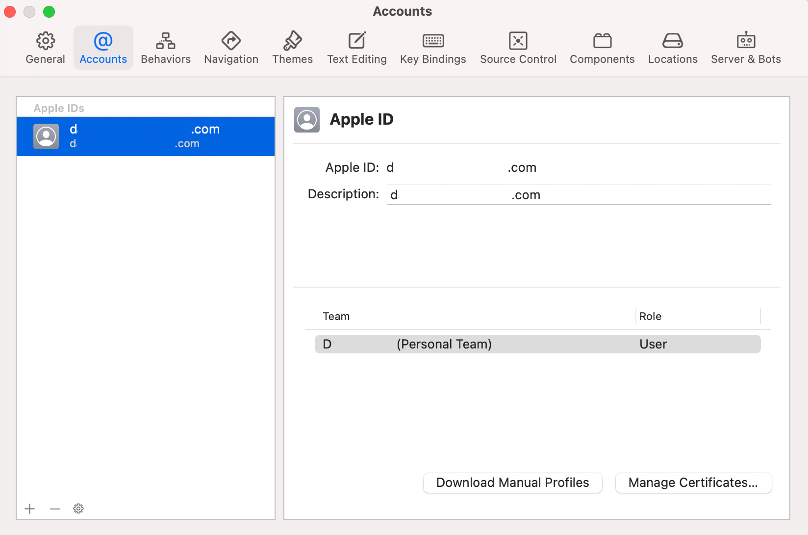
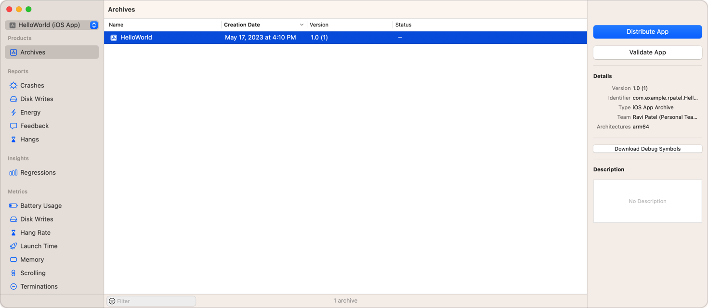
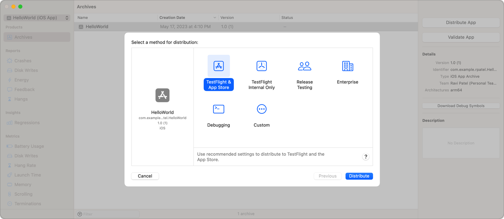

# Catalunya Offline v3. Manual de gestores de aplicacion

En este documento describiremos el proceso de publicación en las dos plataformas, ios e android.
En todo momento se asume que se tiene preparado el entorno de desarrollo.

## IOS

### Software necesario

* Xcode: >= 14.1
* Homebrew
* Xcode Command Line Tools

**Xcode** es el princpial IDE para desarrollar software compatible con el ecosistema de Apple. Se puede instalar desde la appStore en cualquier mac que esté actualizado a la última versión.

**Homebrew** es un gestor de paquetes alternativo para los disposivos MacOS. 
Hace una función similar a un gestor de paquetes apt en una distribución Linux basada en Debian.
Se puede consultar su [web](https://brew.sh/) para más información.
Para instalar desde una terminal en MacOS:

    /bin/bash -c "$(curl -fsSL https://raw.githubusercontent.com/Homebrew/install/HEAD/install.sh)"

**Xcode Command Line Tools** en un conjunto de herramientas de consola para poder desarrollar software similar a un sistema UNIX. 
Trae desde git hasta make, y una larga lista de cli para desarrollo. La documentación de este paquete está disponible [aqui](https://mac.install.guide/commandlinetools/index.html).
La lista de paquetes que trae se puede consultar en https://mac.install.guide/commandlinetools/8.html
Para instalar, también desde un terminal de MacOS:

    xcode-select –-install

### Abrir proyecto en Xcode

En nuestro proyecto, tal y como se explicó en el taller de desarrollo, tenemos un `package.json`. 
Este fichero tiene la siguiente tarea:
    
    "build:ios": "npm run build && capacitor sync && capacitor open ios"

Se encarga de hacer build del proyecto webpack, sincronizar la capa de Capacitor y abrir el proyecto en Xcode.

### Debug en un dispositivo iOS

Desde Xcode, con un Iphone conectado, se puede hacer Run del Proyecto y este se desplegará en el dispositivo.
Desde safari, necesitamos activar las herramientas de desarrollo desde el menu.

    Safari > Ajustes > Avanzado => “Mostrar el menú Desarrollo en la barra de menús”

Ahora, con el proyecto abierto en el móvil, desde safari podemos abrir un developer tools remoto con el código que se está ejecutando el el Iphone.

### Deploy a la appStore

Enlace con información sobre [login y gestión de certificados](https://www.codecademy.com/article/ios-how-to-set-up-your-development-certificate-and-profile).

Lo primero que necestiamos en Xcode es loguearnos con nuestro AppleID asociado al developers group del ICGC.
En Xcode, vamos a ajustes > Acccounts:

En la lista pulsamos `+` y nos logueamos.

Lo siguiente es archivar la app para su deploy en AppStore y Testflight. En Xcode vamos a Product > Archive. Esto compilará la app y se nos abrirá la siguiente ventana:

Una vez en esta ventana, podemos validar la app, o distribuirla directamente, que tambien hace el proceso de validar.
Al pulsar en **Distribute app** se nos abrirá la siguiente ventana:

Y seleccionamos **Testflight y AppStore**. Esto firmará nuestra app y la subirá a AppStore sin publicar, pero sí estará disponible para nuestro grupo de testeo en testflight.

Para publicar la app se hace directamente desde la web de [AppStoreConnect](https://appstoreconnect.apple.com/).

